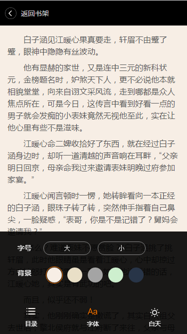

---
#webappbook
-------------

前端-移动APP阅读器预览：http://htmlpreview.github.io/?https://github.com/whhlulu/webappbook/blob/master/index.html
项目背景：慕课实战素材，对其学习及修改

作用介绍：对于移动端的文字阅读器

####示例:

###使用框架
1.lib/zepto.min.js 相当于移动版的jquery

2.js/jquery.base64.js base64解析

3.js/jquery.jsonp.js jsonp使用

###使用方法
最简单的html使用，素材，json都在项目中，不需要后台。

### 注意事项
由于功能较简单，js，css都未抽离
index.html为普通版
promise.html使用了promise，但是用的并不完全，有兴趣的可以参考，给出建议！

###TODO
增加模态框
继续完善其他上行页面和功能

## License
暂无
